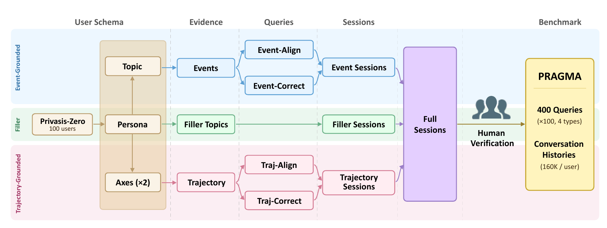

# 🧩 PRAGMA

This is the official repository for **PRAGMA: Evaluating Personalized Guidance with Memory Alignment in Lifelong Conversations** (EMNLP 2026).

[](https://huggingface.co/datasets/stellahj/PRAGMA)

---

## 📂 Directory Layout

<details>
<summary>Show repository structure</summary>

```text
PRAGMA/
  config.yaml
  pipeline/
    config.py
    run_pipeline.py
    sample_users.py
    extract_schema.py
    create_events.py
    event_query.py
    create_traj.py
    traj_query.py
    evid_sessions.py
    filler_sessions.py
    full_sessions.py
  metrics/
    eval_criteria.py
  figures/
    pipeline.png
  requirements.txt
```

</details>

## 📦 Using the Released Benchmark

The released benchmark and evaluation rubrics are hosted in the [PRAGMA dataset repository on Hugging Face](https://huggingface.co/datasets/stellahj/PRAGMA). Download them into the expected local directory with:

```bash
python -m pip install -U huggingface_hub
hf download stellahj/PRAGMA \
  --repo-type dataset \
  --include "data/*.json" \
  --local-dir .
```

Most users only need:

- `data/full_sessions.json`: timestamp-ordered conversation histories for 100 users.
- `data/metadata.json`: 400 benchmark queries with query types and gold evidence-session indices.
- `data/response_metrics.json`: released alignment and grounding rubrics.

Join records by `user_id`. For each item in `metadata.json`, `evidence_session_index` selects the gold evidence sessions from that user's `sessions` array in `full_sessions.json`. Match rubric records in `response_metrics.json` by `(user_id, query)`.

The experiments reported in the paper used GPT-5 (`gpt-5-2025-08-07`) as the default LLM judge for the released alignment and grounding rubrics.

## 🛠️ Reconstructing or Extending the Benchmark

The construction pipeline is provided for researchers who want to recreate PRAGMA or extend it with additional data.

### Pipeline Overview



### Installation

Python 3.10 or newer is recommended.

```bash
git clone https://github.com/yuhyojeong/PRAGMA.git
cd PRAGMA
python3 -m venv .venv
source .venv/bin/activate
python -m pip install --upgrade pip
python -m pip install -r requirements.txt
```

On Windows PowerShell, activate the environment with `.venv\Scripts\Activate.ps1` instead of `source .venv/bin/activate`.

Set an OpenAI API key before generating model-produced artifacts:

```bash
export OPENAI_API_KEY="your-api-key"
```

### Configuration

Edit `config.yaml` to use other OpenAI models or change generation concurrency, retry limits, and user-sampling settings. Model IDs are configured separately for each construction task, so stages can be changed independently. Stages that request JSON-schema outputs require an OpenAI model that supports Structured Outputs.

The evidence and filler `concurrency` values control how many users are processed in parallel. `filler_sessions_per_user` controls concurrent session generation within each filler user. Reduce these values if API rate limits are encountered. All configuration fields are required; missing or invalid values stop the pipeline with an explicit error.

### Run the Pipeline

Run all construction stages:

```bash
python pipeline/run_pipeline.py
```

Include evaluation-rubric generation:

```bash
python pipeline/run_pipeline.py --with-metrics
```

<details>
<summary>Partial runs and stage-by-stage outputs</summary>

The runner supports `--start`, `--end`, `--only`, `--skip`, and `--dry-run`:

```bash
python pipeline/run_pipeline.py --start create_events
python pipeline/run_pipeline.py --start event_query --end traj_query
python pipeline/run_pipeline.py --only event_query,traj_query
python pipeline/run_pipeline.py --skip sample_users
python pipeline/run_pipeline.py --dry-run
```

| Step | Script | Input | Output |
|---:|---|---|---|
| 1 | `pipeline/sample_users.py` | Hugging Face `nvidia/Privasis-Zero` | `data/privasis.json` |
| 2 | `pipeline/extract_schema.py` | `data/privasis.json` | persona, axes, rewritten axes, and topic in `query_data.json` |
| 3 | `pipeline/create_events.py` | `data/query_data.json` | events and event timestamps |
| 4 | `pipeline/event_query.py` | event fields | type 1/2 queries and type 2 evidence indices |
| 5 | `pipeline/create_traj.py` | `data/query_data.json` | trajectory states and timestamps |
| 6 | `pipeline/traj_query.py` | trajectory fields | type 3/4 queries and type 4 evidence indices |
| 7 | `pipeline/evid_sessions.py` | `data/query_data.json` | `data/evid_sessions.json` |
| 8 | `pipeline/filler_sessions.py` | `data/query_data.json` | `data/filler_sessions.json` |
| 9 | `pipeline/full_sessions.py` | evidence and filler sessions | `full_sessions.json` and `metadata.json` |
| 10 | `metrics/eval_criteria.py` | metadata and query data | `response_metrics.json` |

To regenerate rubrics separately, run:

```bash
python metrics/eval_criteria.py
```

This overwrites `data/response_metrics.json`.

</details>

## 🧭 Query Types

| Type | Name | Gold evidence scope | Expected behavior |
|---|---|---|---|
| `type1` | Event-Align | All event sessions for the user | Recommend a next step that builds on prior event-level experiences. |
| `type2` | Event-Correct | Event sessions involved in the incorrect recollection | Detect and correct a mistaken recollection in the query. |
| `type3` | Trajectory-Align | All trajectory-state sessions for the user | Position the user in a way that reflects their evolving trajectory across multiple states. |
| `type4` | Trajectory-Correct | Trajectory-state sessions that provide counter-evidence | Detect a decision that conflicts with the user's prior trajectory. |

## 📄 Data Reference

<details>
<summary>Show files, fields, and index relationships</summary>

- `data/privasis.json` — sampled source users.  
  Fields: `id`, `profiles`, `event_list`.
- `data/query_data.json` — one benchmark specification per user.  
  Fields: `user_id`, `persona`, `axes`, `topic`, `events`, `event_timestamps`, `type1`, `type2`, `type2_evid`, `trajectory`, `trajectory_timestamps`, `rewritten axes`, `type3`, `type4`, `type4_evid`.
- `data/evid_sessions.json` — generated evidence conversations.  
  Fields: `user_id`, `persona`, `event_timestamps`, `event_turns`, `trajectory_timestamps`, `trajectory_turns`.
- `data/filler_sessions.json` — unrelated filler conversations.  
  Fields: `user_id`, `persona`, `filler_topics`, `filler_turns`.
- `data/full_sessions.json` — final histories sorted by timestamp.  
  Fields: `user_id`, `persona`, `timestamps`, `session_types`, `sessions`, `topics`.
- `data/metadata.json` — one record per `(user_id, query_type)`.  
  Fields: `user_id`, `persona`, `query_type`, `query`, `query_timestamp`, `evidence_session_timestamps`, `evidence_session_index`, `summarized_evidence`.
- `data/response_metrics.json` — one record per evaluation item.  
  Core fields: `user_id`, `query_type`, `query`, `evidence`, `alignment_metric`, `grounding_metric`.

Index relationships:

- `type2_evid` indexes into `events`; `type4_evid` indexes into `trajectory`.
- `event_turns[i]` corresponds to `event_timestamps[i]`; `trajectory_turns[i]` corresponds to `trajectory_timestamps[i]`.
- `filler_turns[i]` corresponds to `filler_topics[i]`.
- `evidence_session_index` indexes into the corresponding user's `sessions` in `full_sessions.json`.
- `session_types` contains `event`, `trajectory`, or `filler`.

</details>

## 📝 Notes

- Generation scripts call OpenAI models and may take time.
- Keep queries, evidence fields, metadata, and evaluation rubrics synchronized when extending the benchmark.

## 📜 Citation

Citation information will be added with the paper release.
